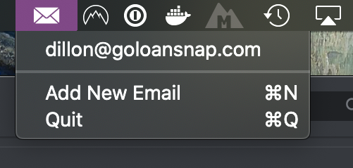

# Gmail Copier


A status bar app for quickly copying a _unique_ email address using the same gmail account. Just launch the app, add your email and then the next time you need a unique email address pop it open and click on your email address. When you click on your email it will copy the address to the clipboard but append current unix timestamp to your username.

```
dillon+1575688348@goloansnap.com
```

I don't know but I've been told, this `+` thing only works for gmail. Oh and the app only works for Mac. So I guess we're even.
